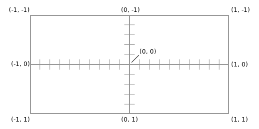

# Tutorial 1: hello shaders

Hello, and welcome to LearnShaders.com! This series of tutorials will gradually introduce you to shaders, and teach you how to use them to make interactive web animations.

In this first tutorial you'll be introduced to some core features of the GLSL language and build an interactive toy that you can share with the world.

## Your first shader

OK let's write a shader. The editor interface below lets you type GLSL code and see the results immediately. Each exercise on this site has a code sample that you need to type into the editor. I encourage you to actually type the code samples in - there's nothing to stop you from copying and pasting, but the experience of typing will make the code stick in your mind much more effectively.

<pre data-editor="frag">
void main() {
    gl_FragColor = vec4(1.0, 0.0, 0.5, 1.0);
}
</pre>

You done? If so then the preview window should have turned hot pink - the best of all the colors. The kind of shader you just wrote is a fragment shader. The purpose of a fragment shader is to decide what color each pixel is.

Let's break down the above example:

* `void main() {` - creates a function (called "main") that does not return a value (`void`). Every shader needs a `void main` function.

* `gl_FragColor` - this is a built-in variable. Assigning a value to this variable sets the color of the fragment. All variables beginning `gl_*` are magically provided by GLSL and used to provide data to your shader or send data out.

* `= vec4(1.0, 0.0, 0.5, 1.0);` - this is the color you have assigned to the fragment. Colors in GLSL are represented as a vec4 which is a list (vector) of 4 numbers representing red, green, blue and alpha (transparency). This color is full red, no green, half blue and full opacity, which is hot pink.

**Exercises**

1. Try playing with the numbers in the vec4 above to create new colours - alter the first three numbers in the vector to change the color, and the last number to change the transparency. Semi-transparent colours will appear as a checkerboard pattern. Values are clamped to the range 0 to 1, so entering a value for red of 2.0 or of -20 for green will make no difference to the color.

2. You don't have to assign the whole RGBA color at once - you can assign to individual color channels. Add a line gl_FragColor[1] = 1.0; to the above program. This sets green to 100% resulting in the color 1,1,0.5,1, or light yellow. Now try using gl_FragColor.g instead of square bracket notation - the vec4 type maps the fields r, g, b and a to positions 0, 1, 2 and 3 in the vector to help with readability.

3. Read the section on error highlighting below and then try introducing some errors into your code to see the kind of messages you get.

## Error highlighting

While typing the exercise above you probably saw some error messages come up. If you type invalid GLSL code, the browser will tell you the line number of the error and this line will be highlighted in red.

The two kinds of error you'll see most often are type errors and syntax errors.

*Type errors* happen when you try to combine two values of incompatible types. For example, if you type `gl_FragColor.r = 1;` then you'll get an error saying something like "Can't convert from ‘const int' to ‘mediump float'." This is telling you that the value "1" is an integer, and gl_FragColor is a vec4 which expects its components to be floating point numbers. You can fix the error by changing "1" to "1.0". GLSL is quite strict about not mixing incompatible number types.

*Syntax errors* happen when your code doesn't meet the rules of the GLSL language. You'll see them often as you type, because your half-competed code will be temporarily invalid. Bear in mind however that line numbers in syntax error messages can be misleading. For example, try deleting the semi-colon from the end of a line in a valid program. The browser will tell you that there's an error on the *next* line. This is because it wasn't until the browser got to the next line character that it realised there was a problem.

If you can't find the cause of an error, the best bet is to google the full text of the error message.

## Thinking inside-out: emergent properties

It might not have been obvious when you completed the above exercise, but the shader program you created actually ran a few hundred thousand times. That's because a fragment shader runs once per pixel and outputs a single color value for that pixel, so coloring in a 100 x 100 pixel square requires 10,000 invocations of the fragment shader.

This can take a bit of getting used to. If you've done graphics programming before, say in Flash or HTML5 Canvas, you might be used to commands that draw shapes like circles and rectangles. In a fragment shader, all you can do is control the color of a single pixel. This means that drawing anything more complicated than a flat color requires you to think in terms of emergent properties.

<iframe width="560" height="315" src="https://www.youtube.com/embed/8vhE8ScWe7w" frameborder="0" allowfullscreen></iframe>

The shape and motion of a flock of birds is an example of an emergent property - there is no rule that describes directly how the flock behaves, instead each individual bird follows a few simple rules, and when a flock of thousands of birds all follow the same rules then you get complex results. (Scientists have a pretty good idea of the exact rules each bird is following, you can [read more here](http://en.wikipedia.org/wiki/Flocking_(behavior))).

So when you're creating a shader, you need to think inside-out, and come up with some rules that when followed by every pixel will create the effect that you want.

## Drawing a gradient

Let's try using emergence to create a gradient. A gradient is a smooth transition between two colors A and B, such that at the start of the gradient all pixels are pure A, at the end they're pure B, and in between the colors gradually change from A to B.

To create a fragment shader that draws a gradient, each pixel needs to know where it is on that gradient. It can do that using the v_position varying. You'll learn more about varyings later, but for now just know that it's a vec2 of the pixel's position in *world space coordinates*:

This shader creates a gradient from black vec4(0,0,0,1) to white vec4(1,1,1,1).

<pre data-editor="frag">
void main() {
  // p will be 0 at the left and 1 at the right
  float p = v_position.x * 0.5 + 0.1;
  gl_FragColor = vec4(p, p, p, 1.0);
}
</pre>

A few features of the above program worth mentioning:

* We're using `position.x` to access the first component of the vector. Like the r, g, b and a fields used in the first exercise, vector types also map the x, y, z and w fields to the four component numbers. The `gl_FragCoord` vector doesn't "know" that it's a color. You could swab gl_FragCoord.x for gl_FragCoord.r and it would work just the same. For greatest readability, use rgba when your vector represents a color and xyzw when it's a coordinate.

**Exercises**

* Reverse the gradient by changing line 6 so that x is 1 at the left and 0 at the right [reveal answer](# "1 - gl_FragCoord.x / u_CanvasSize.x")

* Turn this into a vertical gradient. Before you do this, look at the "screen coordinates" diagram above, and figure out what the code on line 6 should be to put pink at the top and yellow at the bottom. [reveal answer](# "gl_FragCoord.y / u_CanvasSize.y")

## Moar color!

That's not very interesting. The last shader was pink. I demand more pink!

To make a color gradient you need to calculate a linear interpolation between the two colours. I'll show you how to do this manually because it shows off a really nice feature of GLSL, then tell you about the built-in function that does it for you.

A linear interpolation Interpolation is a concept you'll use a lot in graphics programming, and it's easiest to see how it works on numbers:

<pre data-highlight="JavaScript">
// JavaScript function to interpolate between two numbers. Returns
// x if a == 0, y if a == 1, or an appropriate intermediate value
function interpolate(x, y, a) {
    return x * (1-a) + y * a;
}
interpolate(5, 10, 0);   // returns 5
interpolate(5, 10, 1);   // returns 10
interpolate(5, 10, 0.5); // returns 7.5
interpolate(5, 10, 0.8); // returns 9
</pre>

Colors are represented as RGBA values, and in order to create a color half way between two RGBA values you interpolate each color channel separately. For example hot pink is `vec4(1, 0, 0.5, 1)` and yellow is `vec4(1, 1, 0, 1)`, so half way between hot pink and yellow is `vec4(1, 0.5, 0.25, 1)`.

A really nice feature of GLSL is that vectors support all basic mathematical operators like addition and multiplication, both with other vectors and with floating point numbers. So if you have a vec2 V, then:

`V * 2.0` is equivalent to `vec2(V[0] * 2, V[1] * 2)`

`V * V` is equivalent to `vec2(V[0] * V[0], V[1] * V[1])`

This means that the code to do a linear interpolation of two colors is exactly the same as with two numbers:

<pre data-editor="frag">
void main() {
    vec4 pink = vec4(1.0, 0.0, 0.5, 1.0);
    vec4 yellow = vec4(1.0, 1.0, 0.0, 1.0);
    float p = v_position.x * 0.5 + 0.5;
    gl_FragColor = pink * (1.0-p) + yellow * p;
}
</pre>

**Exercises**

* GLSL provides a built in function called `mix(x, y, a)` that works just like the `interpolate` JavaScript function above. Delete the interpolation formula and replace it with a call to mix.

* Make a 45 degree gradient that is pink in the bottom left and yellow in the top right. [reveal solution](# "float p = (v_position.x + v_position.y) * 0.25 * 0.5")

## Interactive controls

The u_CanvasSize value that you used earlier is an example of a uniform - a value provided from JavaScript to your shader that is the same across all fragments. The editor allows you to add inputs which will become available to your shader. The `u_` prefix is not required but is a common convention - using it will make it easier for other programmers to understand your shaders.

This editor has two color pickers set up. The colors chosen by these pickers are available in your shader as uniforms called `u_LeftColor` and `u_RightColor`.

<pre data-editor="frag">
void main() {
    float p = gl_FragCoord.x / u_CanvasSize.x;
    gl_FragColor = mix(u_LeftColor, u_RightColor, p);
}
</pre>

You can add your own inputs to any shader using the inputs button. You've seen the color picker input. Let's try adding another. Click the inputs button on the editor and add a slider input called u_SliderInput that produces values between 0.1 and 10. Now add a line to the shader that raises p to the power of the slider input:

<pre data-highlight="GLSL">
p = pow(p, u_SliderInput);
</pre>

See the effect that moving the slider has on the gradient. By adding a power transformation to the p value you're replacing the linear interpolation with an exponential interpolation. When animating values, exponential interpolations with a power less than 1 are referred to as "easing out" and powers greater than one are "easing in".

## Drawing shapes

Your eyes are much better at detecting subtle variations in position than in lightness, so here's a trick to make it easier to visualise the effect of exponential interpolation. In the following multi-step exercise we're going to draw a line graph on the canvas that plots the relationship between the gradient value and the X axis.

You're about to create an additional function (in addition to main()). One important thing to know about functions is that they must appear before the functions that use them, so main() will typically be the last function in your shader.

<pre data-editor="frag">
// STEP 1:
// this function blacks out any pixel whose height
// is less than `value`, visualising how `value`
// changes along the x axis.
void graph(float value) {
  float yPos = gl_FragCoord.y / CanvasSize.y;
  if (value > yPos) {
    gl_FragColor = vec4(0, 0, 0, 1);
  }
}

// STEP 2:
// the first example is too destructive. This
// example draws a thinner line by blacking
// out pixels that are within 2.5% of the
// canvas height
void graph(float value) {
  float thickness = 0.025;
  float yPos = gl_FragCoord.y / resolution.y / 2.0;
  float diff = abs(value - yPos);
  if (diff < thickness) {
    gl_FragColor = vec4(0, 0, 0, 1);
  }
}

// STEP 3:
// a black line won't be visible against a dark
// background, so this version draws a two-tone line.
void graph(float value) {
  float thickness = 0.025; // 2.5%, for a 5% thick line
  float yPos = gl_FragCoord.y / resolution.y / 2.0;
  float diff = abs(value - yPos);
  if (diff < thickness) {
    float v = (diff / thickness) * 20.0 - 10.0;
    gl_FragColor = vec4(v, v, v, 1);
  }
}
</pre>

**Exercise**

Carefully read through the code examples above and make sure that you understand why they do what they do. If you understand how this code draws a line, you understand emergence.

Test your understanding: why does the line get thinner thinner as it gets steeper? [reveal answer](# "The line has a constant height of 5% of the canvas size, so appears thinner when the line is steeper for exactly the same reason that the line drawn by an italic calligraphy pen varies in thickness depending on the angle it is held at")

Sharing your work

By now you've created a little interactive toy with some input and a moderately pretty output. You'll get much more advanced later, but if this is the first time you've written a shader you should be proud of your work. Time to show it off!

This site lets you publish shader code for the world to see. You can manage your published shaders on your account page. Click the "share" button to publish a new shader based on the code in the editor window. This will create a public URL where people can see the shader and play with the inputs.

Clicking "share" again will publish a new shader - if you want to edit a previously published shader, go to "my account" and edit it.
